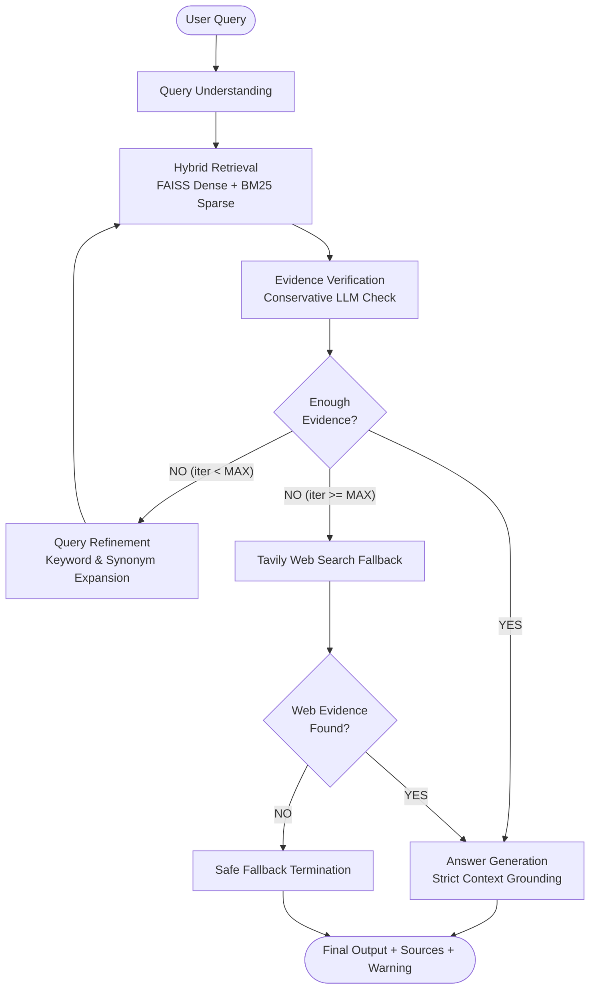

# Corrective/Adaptive RAG (CRAG) with LangGraph

A modular **Corrective/Adaptive Retrieval-Augmented Generation (CRAG)** system in Python using **LangGraph**, **Google Gemini**, **Cohere Embeddings**, local **FAISS + BM25 Hybrid Retrieval**, and automated **Tavily Web Search** fallback.

---

## Architecture Workflow



---

## Features

- **Hybrid Retrieval**: Combines semantic dense vector search (FAISS) and lexical keyword search (BM25 Okapi) with deduplication.
- **Query Understanding & Adaptive Refinement**: Optimizes user prompts into concise search queries and iteratively refines keywords if evidence is initially insufficient.
- **Conservative Evidence Verification**: Uses structured output to strictly evaluate if retrieved excerpts contain concrete facts before answering.
- **Tavily Web Search Fallback**: Automatically searches the live web if internal document retrieval fails to satisfy evidence requirements after maximum attempts (`MAX_ITERATIONS`).
- **Grounded Answer Generation**: Strictly answers using provided context documents with evidence-support confidence scoring, deduplicated source citations, and hallucination risk warnings.
- **Local FAISS Caching**: Vector store persists to disk on first run (`vectorstore/`) to avoid unnecessary re-embedding.

---

## Project Structure

```
CRAG/
│
├── documents/               # Place PDF, TXT, or DOCX documents here
│   ├── WHO_TB_2022.pdf
│   └── WHO_TB_2024.pdf
│
├── pipeline/
│   ├── __init__.py
│   ├── ingestion.py         # Document parsing, chunking, and FAISS indexing
│   ├── retrieval.py         # FAISS + BM25 hybrid search
│   ├── query.py             # Query understanding & corrective refinement
│   ├── verification.py      # Conservative LLM evidence verification
│   ├── generation.py        # Grounded answer generation & source citations
│   ├── web_search.py        # Tavily web search fallback
│   └── graph.py             # LangGraph state machine & conditional routing
│
├── config.py                # Environment configuration
├── main.py                  # Interactive terminal chatbot
├── requirements.txt         # Project dependencies
├── .env.example             # Template for API keys
└── .gitignore               # Ignores .env and local data
```

---

## Quickstart

### 1. Clone & Setup Environment

```powershell
git clone https://github.com/safal11goyal/CRAG.git
cd CRAG

# Create and activate virtual environment
python -m venv venv
.\venv\Scripts\Activate.ps1

# Install dependencies
pip install -r requirements.txt
```

### 2. Configure Environment Variables

Create a `.env` file based on `.env.example`:

```ini
GOOGLE_API_KEY=your_gemini_api_key
COHERE_API_KEY=your_cohere_api_key
TAVILY_API_KEY=your_tavily_api_key

GEMINI_MODEL=gemini-3.1-flash-lite
EMBEDDING_MODEL=embed-english-v3.0
RETRIEVAL_K=4
MAX_ITERATIONS=3
```

### 3. Run the Chatbot

```powershell
python main.py
```

Type `exit` or `quit` to exit.
